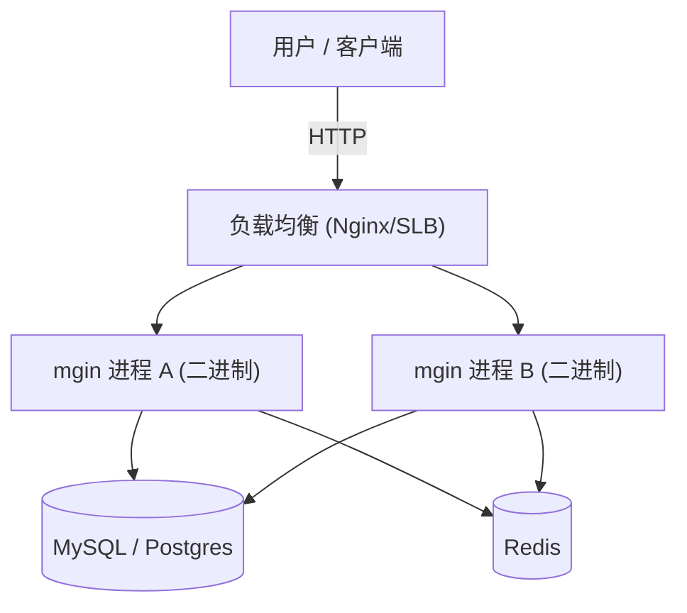
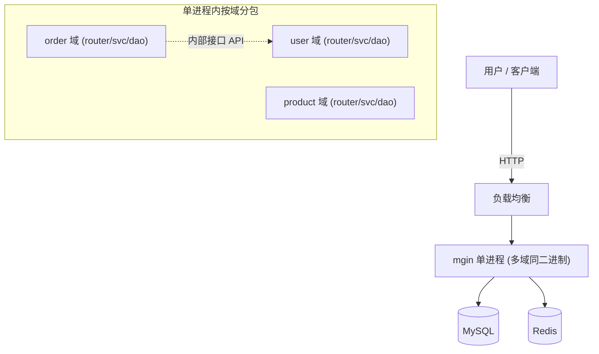
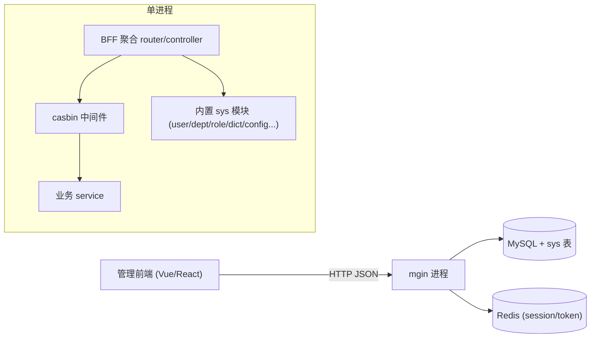
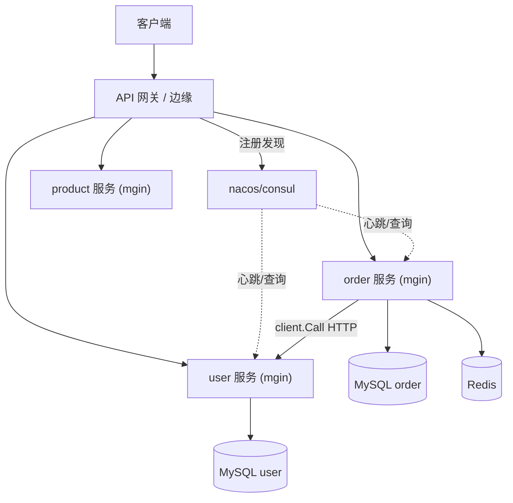
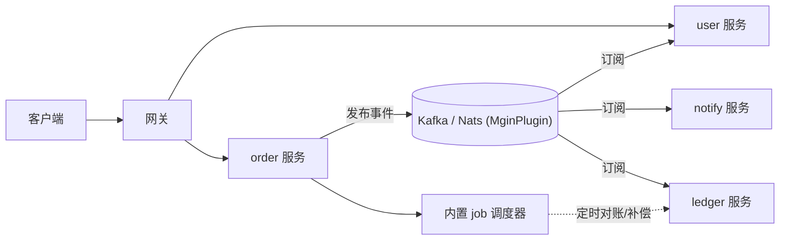
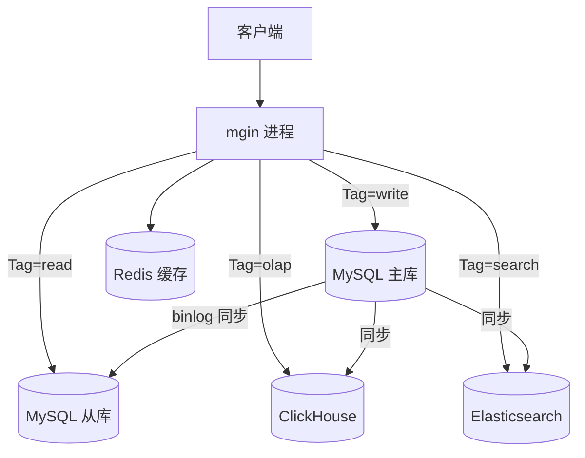
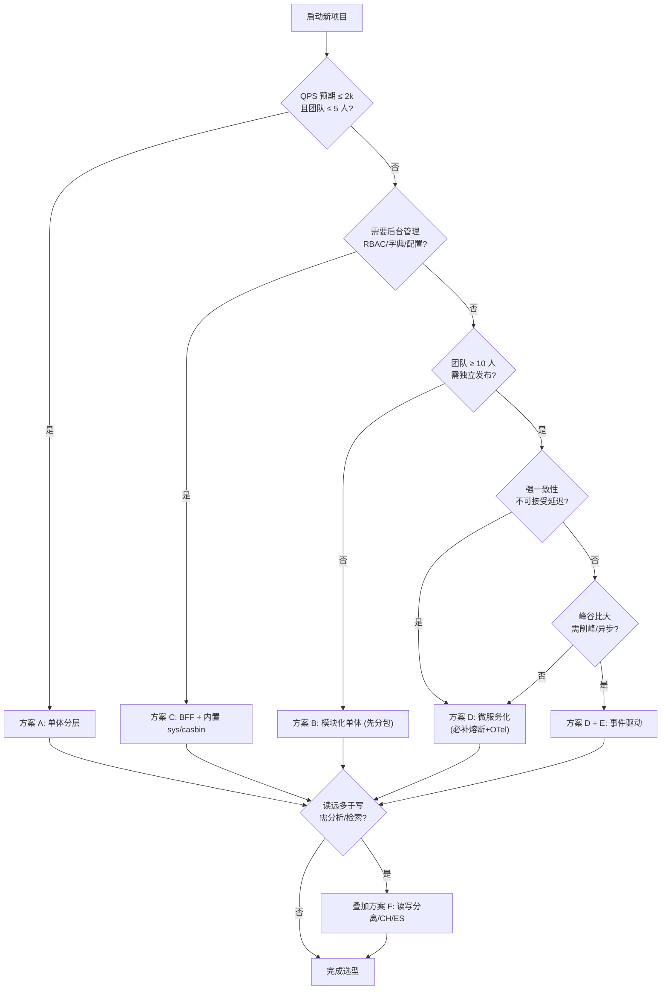
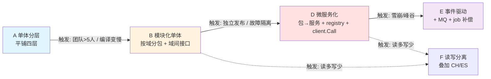

# mgin 框架项目系统架构选型与优劣分析

- **文档版本**：v1.0
- **日期**：2026-09-04
- **作者**：架构师 高见远（software-mgin-arch 团队）
- **适用对象**：基于 mgin（单进程 Gin HTTP 框架 + 基础设施胶水层，Go 1.25）搭建项目的架构/技术负责人
- **阅读前置**：README_CN.md 因内容策略不可读取，本文档全部能力描述均基于**源码实测**，凡推断项以 `> ⚠️ 推断：...` 标注。

---

## 0. 结论先行

### TL;DR

> mgin 是**单进程、单二进制、单 gin.Engine** 的"HTTP 框架 + 基础设施胶水层"，它把数据源连接、注册发现、配置中心、服务间 HTTP 调用、定时任务、系统管理模块、权限中间件**打包进一个进程生命周期**。
> **用 mgin 做架构选型，本质是在选"进程边界"和"集成方式"，而不是在选框架**——框架已经把"单进程内能做什么"做满了，真正的分叉点只在"要不要拆进程 / 怎么跨进程通信 / 数据怎么分布"。

一句话判断：**如果你的系统一台机器一个二进制就能扛住，mgin 可以让你几乎不写胶水代码直接上线；一旦你需要多团队并行、独立发布、强故障隔离或跨语言，mgin 的"胶水"反而会变成你需要绕开或自建的部分。**

### 实测能力边界（一图速览）

| 维度 | mgin 现状（源码实测） | 标注 |
|------|----------------------|------|
| 进程模型 | 单进程、单 gin.Engine，HTTP+HTTPS 同 Router | 框架已内置 |
| 数据源 | mysql/postgres/sqlite/mongodb/redis/clickhouse/elasticsearch/kafka/s3 + job | 框架已内置 |
| 注册发现 | nacos/etcd/consul/polaris | 框架已内置 |
| 服务调用 | `client.Call` = HTTP（非 RPC），自动透传 trace | 框架已内置，但**治理弱** |
| 配置中心 | nacos/consul/etcd/polaris/springconfig/file | 框架已内置 |
| 定时任务 | 内置类 xxl-job 调度器（robfig/cron v3） | 框架已内置 |
| 系统管理 | models/sys 全套（用户/部门/角色/字典/配置/在线…） | 框架已内置 |
| 权限 | casbin + jwt + session + iplimit + xss + limit + ratelimit | 框架已内置（限流仅单机） |
| 数据访问 | 泛型 DAO，mysql/postgres/clickhouse/mgo 四实现 | 框架已内置 |
| 缓存 | icache + memcache/diskcache + gorm 二级缓存 | 框架已内置 |
| 熔断/降级/集群限流 | 无（仅单机 ratelimit） | **框架不擅长 / 需自建** |
| 分布式锁/事务/Saga | 无 | **框架不擅长 / 需自建** |
| 链路追踪 | 仅 TraceId 透传，无 OTel 埋点采样 | **框架不擅长 / 需自建** |
| 优雅关闭 | 5 秒硬编码；**HTTPS server 未 Shutdown** | **框架缺陷** |
| gRPC | 无（仅 indirect 依赖） | **框架不支持** |
| 多数据源读写路由 | 需自行实现（DAO 仅有 `Tag func() string` 字段，无自动路由） | **需自建** |
| 测试基建 | 薄弱（configure_test/job_test/util_test） | **框架不擅长** |

### 本文档能给你什么

1. 6 套从单体到分布式的**可落地**架构方案，逐套给出拓扑、代码组织、数据层、通信方式、mgin 特性利用清单、优缺点、演进触发点。
2. 一张大对比表 + 一张选型决策表 + 一张 Mermaid 决策流程图，帮你在 30 秒内定档。
3. 与 mgin 强相关的深度建议（泛型 DAO 瓶颈、HTTP 调用代价、健康探针、空白区补齐、分层纪律）——这是本文档最见功力的部分。
4. A→B→D 渐进式演进路线图，强调"先分包、后拆进程"的最低成本路径。
5. 一份待你确认的清单，避免我在错误假设上做设计。

---

## 1. 架构方案（6 种，覆盖单体→分布式完整光谱）

> 通用说明：以下所有方案都**沿用 mgin 脚手架的基础分层** `router → controller → service → dao → model`。差异在于"这几层是放在一个进程里、还是拆成多个进程"，以及"跨边界时走函数调用还是 HTTP/MQ"。

---

### 方案 A：单体分层架构（脚手架原教旨，单二进制）

**一句话定位**：mgin `mgin new` 开箱即用的形态——一个进程、一个二进制、一个 gin.Engine，所有业务代码按 router/controller/service/dao/model 四层平铺。

**适用规模**
- 团队：1–5 人，单人可全栈负责
- QPS：≤ 2000（单实例；靠加副本水平扩容到万级）
- 模块：≤ 20 个业务实体
- 发布频率：日级或周级，单机滚动发布可接受

**部署拓扑**



**代码组织**（单 module、单仓库、多包平铺；沿脚手架基线，**不拆分**）

```
project/
├── main.go
├── version.go
├── router/router.go
├── controller/controller.go
├── service/service.go
├── dao/dao.go
├── model/model.go
└── conf/application.yml
```

与脚手架关系：**完全沿用**，无需扩展。

**数据层设计**
- 数据源：`go.config.used` 开 mysql + redis（常规）或加 sqlite（嵌入式）。
- 读写：单主库，无强制读写分离；热点读走 Redis（`cache` 包）。
- 泛型 DAO：直接用 `db/dao` 的 `MySQLDao[E]`/`PostgresDao[E]`，`Tag` 字段为 nil 时回落 `notag` 即主连接。

**服务间通信**：无（单进程内函数调用 `controller → service → dao`）。

**配置与治理**
- 配置中心：小项目用 `file` 即可；稍大用 nacos/consul。
- 健康检查：`checkAll()` 每 5 分钟轮询数据源连通性，**足够**；本档无需补探针（见 §3.3）。

**mgin 特性利用清单**
- 第 1 条：`NewApp` + `app.Run()` 生命周期、HTTP/HTTPS 同启、信号捕获 `SafeExit`
- 第 1 条全局中间件：trace/postlog/cors/nice.Recovery/NoRoute
- 第 2 条：mysql/redis 数据源 Init/Close/Check + `checkAll`
- 第 10 条：泛型 DAO
- 第 11 条：cache（memcache/diskcache）

**优点**
1. 零胶水：数据源、中间件、日志全部框架接管，业务只写四层。
2. 单二进制部署极简，CI/CD 一条命令。
3. 调试链路短：一次请求全在一个进程，pprof/日志无跨进程拼接。
4. 泛型 DAO 省去大量样板 CRUD。

**缺点/风险**
1. 全量编译随代码增长变慢（见演进触发点）。
2. 任一模块崩溃拖累整体（无故障隔离）。
3. 强耦合于 mgin 的 DAO/生命周期，未来换框架成本高（见 §3.1）。
4. HTTPS 优雅关闭存在缺陷（见 §3.4，框架缺陷，非本方案独有）。

**演进触发点（迁往 B 或 D）**
- 单仓库编译 > 3 分钟，或本地改一行全量编译 > 30 秒。
- 发布窗口冲突 ≥ 2 次/月（多人改同一二进制要排队发布）。
- 单实例峰值 QPS 持续 > 5000 且加副本无法解决（如某模块吃满 CPU 拖垮其他）。
- 团队拆分出 ≥ 2 个独立开发小组。

---

### 方案 B：模块化单体（Modular Monolith，单进程按业务域分包）

**一句话定位**：仍是单二进制、单进程，但代码按**业务域（bounded context）分包**，域间只通过**显式内部接口**通信，严禁跨域直接调 dao/controller——为将来拆服务预埋"接缝"。

**适用规模**
- 团队：5–15 人，按域分组
- QPS：≤ 5000（单实例）
- 模块：≥ 20 个业务实体，明显可划域（订单/用户/商品…）
- 发布频率：周级，但希望域间改动能"理论上独立"

**部署拓扑**



**代码组织**（单 module、单仓库、**多业务域包**；在脚手架四层基础上**按域扩展**）

```
project/
├── main.go
├── router/router.go            # 仍统一注册，但按域分组挂载
├── order/
│   ├── controller.go
│   ├── service.go               # 对外暴露 OrderService 接口
│   ├── dao.go
│   └── model.go
├── user/
│   ├── controller.go
│   ├── service.go               # 对外暴露 UserService 接口（order 域只依赖此接口）
│   ├── dao.go
│   └── model.go
└── conf/application.yml
```

与脚手架关系：**扩展**——把四层从"全局平铺"升级为"每域一组四层"，并引入域间接口（`user.Service` 接口供 `order` 依赖，而非直接 `user.dao`）。

**数据层设计**
- 同 A，但**建议每域独立 schema / 库表前缀**，为拆分铺路。
- 域间若需共享数据，走"调用对方 service 接口"或"共享只读从库"，禁止跨域直连对方 dao。

**服务间通信**：同进程函数调用（域间调 `UserService` 接口方法）。**暂不上 client.Call**——保持单进程简单性。

**配置与治理**
- 同 A；`checkAll` 足够。
- 域边界用 Go 的 package 可见性（小写未导出 struct）+ 接口约束来"强制"纪律（见 §3.6）。

**mgin 特性利用清单**
- 同 A 全部。
- 额外吃第 9 条：casbin 按域做资源鉴权（`sys_role_resource`）。
- 隐含利用第 1 条全局中间件统一做 trace/postlog，跨域日志自带 TraceId。

**优点**
1. 保留单体所有优势（单部署、易调试），同时获得逻辑隔离。
2. 域间接口是"未来拆服务的契约"，迁移成本最低（见 §4）。
3. 团队可按域并行开发，互不阻塞编译（Go package 级增量编译）。

**缺点/风险**
1. 纪律要求高：域间接口若被绕过（直接 import 对方 dao），拆分时债爆发。
2. 单进程仍无故障隔离，某域内存泄漏拖垮全站。
3. 共享数据库时，域边界容易被"顺手 join"破坏（需约定）。

**演进触发点（迁往 D）**
- 出现 ≥ 2 个小组要求**独立发布节奏**（单体必须一起发）。
- 某域资源画像与全局明显分化（如订单域 CPU 密集、用户域 IO 密集，想分别扩缩容）。
- 故障隔离成为硬诉求（如支付域必须不被营销活动拖垮）。
- 单进程内存常驻 > 容器 Limit 的 70% 且无法靠加机器解决。

---

### 方案 C：单体 BFF + 内置 sys/casbin（后台管理类系统典型形态）

**一句话定位**：一个 mgin 进程同时承载**前端 BFF 聚合层**与**内置系统管理模块（models/sys）+ casbin 鉴权**，是后台/中台/运营系统的"标准答案"。

**适用规模**
- 团队：2–10 人，含前端
- QPS：≤ 3000（管理后台天然读多写少、并发不高）
- 模块：业务中台 + 一套完整 RBAC/字典/配置管理
- 发布频率：周级

**部署拓扑**



**代码组织**（单 module；在脚手架基础上**启用 sys**）

```
project/
├── main.go
├── router/router.go          # 挂载业务路由 + 引入 sys 路由
├── controller/controller.go  # BFF 聚合：一次请求扇出多个 service
├── service/service.go
├── dao/dao.go
├── model/model.go
├── conf/application.yml       # go.sys.enabled: true, baseUri: /api/v1
└── casbin.conf
```

与脚手架关系：**启用**内置 sys（第 8 条），`go.sys.enabled=true`；鉴权挂 casbin 中间件（第 9 条）。BFF 的"聚合"体现在 controller 层一次调用多个 service 拼装前端所需结构。

**数据层设计**
- MySQL 主库 + sys 系列表（框架已建模型）；Redis 存 jwt/session（jwt 中间件第 9 条）。
- 读写分离可选（见方案 F 思路，但后台系统通常不需要）。

**服务间通信**：单进程函数调用；BFF 层在 controller 内扇出。

**配置与治理**
- 配置中心：nacos/consul（后台系统常需配置热更，如 `sys_config` 联动）。
- 权限：`casbin.conf` + gorm-adapter v3，按 `sys_api`/`sys_resource` 做接口级与菜单级鉴权。
- `checkAll` 足够。

**mgin 特性利用清单**
- 第 8 条：models/sys 全套（11 张表 + request/vo 分包）
- 第 9 条：casbin + jwt + session
- 第 1 条全局中间件（含 postlog 接口审计日志，契合后台合规）
- 第 10/11 条：泛型 DAO + cache

**优点**
1. 开箱即得完整 RBAC、字典、参数配置、在线用户管理，**省掉一个独立 IAM 服务的开发量**。
2. casbin 模型灵活，可细到接口/数据行级。
3. postlog 接口日志天然满足后台操作审计。
4. 单进程部署，运维心智负担最低。

**缺点/风险**
1. sys 模块与业务同库同进程，sys 表结构与业务耦合（迁移/拆分时绑定）。
2. casbin 策略加载在进程内存，**多实例部署时策略一致性需靠配置中心/共享 DB，框架不保证实时广播**（见 §3.4 空白区）。
3. BFF 扇出过多会放大单请求延迟（无超时/熔断兜底，见 §3.2）。
4. 仍是单进程，无故障隔离。

**演进触发点（迁往 D 或 E）**
- 前端团队与后端团队要求独立迭代、独立发布。
- 需要把"用户/鉴权"作为独立通行证服务供多个系统复用。
- 管理后台的聚合逻辑变重，单请求扇出 > 5 个 service 成为常态。

---

### 方案 D：微服务化（多二进制 + 注册发现 + client.Call + 统一网关）

**一句话定位**：按域拆成多个 mgin 二进制，通过 nacos/consul 注册发现 + `client.Call` HTTP 调用互联，前置一个网关/边缘层做统一入口与鉴权下沉。

**适用规模**
- 团队：≥ 10 人，多小组
- QPS：≥ 5000，可水平扩到十万级（分服务独立扩缩）
- 模块：≥ 4 个可独立部署域
- 发布频率：天级甚至小时级，各服务独立发布

**部署拓扑**



**代码组织**（**多 module 或多仓库**，每个服务是独立 mgin 工程；域边界已升级为**进程边界**）

```
order-svc/           # 独立 module / 仓库
├── main.go
├── router/router.go
├── controller/controller.go
├── service/service.go
├── dao/dao.go
└── conf/application.yml   # go.discovery.registry: nacos
user-svc/            # 同上
product-svc/         # 同上
gateway/             # 边缘层（也可复用 mgin + 反向代理）
```

与脚手架关系：**每域一套脚手架**（沿用四层），但**跨域调用从函数调用改为 `client.Call`**，并在网关层统一挂 trace/cors/jwt，业务服务内部中间件可精简。

**数据层设计**
- 每服务**私有数据库**（Database-per-Service），彻底解耦。
- 跨域数据一致性走"最终一致"——通过事件（见方案 E）或补偿，而非分布式事务。
- 泛型 DAO 每服务独立使用。

**服务间通信**
- 同步：`client.Call(service, uri, *Options)`，经 `registry.GetServiceURL` 发现 → **HTTP**（非 RPC）。`Options.Retry` 可开朴素重试。
- 何时用同步 vs 异步：强一致性读取（如下单查库存）走 `client.Call`；可延迟的操作（如发通知、记流水）走 MQ（方案 E）。

**配置与治理**
- 配置中心：nacos/consul（**必需**，每个服务自己的 `go.config.server_type`）。
- 注册发现：nacos/consul/etcd/polaris（**必需**）。
- `checkAll` 仍可用，但**不够**（见 §3.3，需补 liveness/readiness + 网关探活）。

**mgin 特性利用清单**
- 第 3 条：registry（nacos/consul/etcd/polaris）
- 第 4 条：`client.Call` + 自动 trace 透传
- 第 5 条：配置中心
- 第 1/2/8/9/10/11 条：生命周期、数据源、sys（网关侧可复用）、权限、DAO、cache

**优点**
1. 故障隔离：order 服务崩不影响 user。
2. 独立扩缩容与独立发布，团队并行度最高。
3. 技术异构可行（某服务未来可换语言，只要遵守 HTTP 契约）。

**缺点/风险**
1. **`client.Call` 是 HTTP 而非 RPC**：序列化/连接开销大，且无超时/熔断/重试策略（见 §3.2，**本方案最大隐忧**）。
2. 分布式追踪仅靠 TraceId 透传，**缺 OTel 埋点/采样**，跨服务排障靠人肉拼日志。
3. 分布式事务缺失，一致性需业务自己用 Saga/补偿（见 §3.4）。
4. 运维复杂度陡增（多二进制、多配置、服务依赖图、链路排查）。
5. 网关需自建或引入（mgin 本身不是网关）。

**演进触发点（迁往 E 或加重治理）**
- 服务间同步调用链 > 4 跳，尾延迟（p99）恶化。
- 出现"调用方被下游慢服务拖死"的雪崩苗头（急需熔断，见 §3.4）。
- 跨服务数据最终一致性需求变多（引入 MQ 事件，方案 E）。
- 需要削峰填谷 / 异步化（MQ）。

---

### 方案 E：事件驱动 / MQ 解耦（kafka/nats 插件 + job 调度 + 最终一致性）

**一句话定位**：在 D 的基础上引入消息队列（kafka/nats/mqtt/rabbit 以 MginPlugin 注册），将"可异步"的操作改成事件发布/订阅，配合内置 job 调度做补偿与对账，达成最终一致性。

**适用规模**
- 团队：≥ 10 人
- QPS：峰值高、波动大（秒杀/营销/日志流水）
- 模块：存在大量"产生即忘/可延迟"的副作用
- 发布频率：天级

**部署拓扑**



**代码组织**（在 D 的多服务基础上，**加 plugins.go** 注册 MQ 插件）

```
order-svc/
├── main.go
├── plugins.go          # 脚手架多选 MQ 时生成，UsePlugin 注册 kafka
├── router/router.go
├── service/service.go  # 业务写库后 Publish 事件
├── mq/consumer.go      # 订阅处理（或放独立 consumer 服务）
└── conf/application.yml # go.config.used 含 kafka
```

与脚手架关系：**扩展**——启用 `mgin new` 的 MQ 插件生成（`plugins.go`），`go.config.used` 加 kafka/nats。

**数据层设计**
- 写服务本地事务 + 发事件（**本地消息表**模式规避"写库成功但发消息失败"），订阅方消费落自己库。
- 内置 `job` 调度器做"未确认事件重投 / 日终对账"（类 xxl-job，第 7 条）。

**服务间通信**
- 异步主导：事件经 MQ，天然解耦、削峰。
- 同步保留：仅核心链路（如下单实时校验）用 `client.Call`。

**配置与治理**
- 配置中心 + 注册发现（同 D）。
- MQ 自身需运维（分区、消费位、死信）——**框架只提供连接，不提供消费位点监控/死信治理**。

**mgin 特性利用清单**
- 第 6 条：MQ 以 MginPlugin 注册，脚手架生成 `plugins.go`
- 第 7 条：job 调度器做补偿/对账
- 第 2 条：MQ 纳入 `checkAll` 健康检查
- D 的全部特性

**优点**
1. 削峰填谷，下游慢/宕机不阻塞上游（解耦 + 缓冲）。
2. 最终一致性架构清晰，扩展新消费者零成本（加订阅即可）。
3. 配合 job 天然具备"重试/补偿/对账"能力。

**缺点/风险**
1. **一致性变为最终一致**，业务必须容忍"短暂不一致"（如余额显示滞后）。
2. 消息丢失/重复消费的兜底需自己写（幂等、死信、对账），**框架不提供**。
3. 链路排障更难（事件跨服务异步流转，靠 TraceId + 日志检索，仍缺 OTel）。
4. MQ 成为关键依赖，其高可用需独立保障。

**演进触发点（从 D 升级到 E）**
- 同步调用链出现明显雪崩/长尾。
- 峰谷比 > 5:1，需要缓冲。
- 新增"旁路能力"（风控/推荐/审计）不想侵入主链路。

---

### 方案 F：读写分离 / 数据分析型（MySQL 写 + ClickHouse/ES 读 + Redis 缓存）

**一句话定位**：写主库（MySQL/Postgres），读走 ClickHouse（OLAP）/Elasticsearch（检索）+ Redis 缓存，利用 mgin 多数据源与泛型 DAO 的 `Tag` 连接选择器做读写路由——**数据架构维度**的方案，可与 A–E 任意组合。

**适用规模**
- 适合任何"读远多于写 + 有分析/检索需求"的系统
- 单表日增 > 100 万、需要聚合分析或全文检索时必选

**部署拓扑**



**代码组织**（在单体或微服务基础上，**多开数据源 + 自定义 Tag 路由**）

```
project/
├── dao/
│   ├── dao.go            # 写操作: w := &dao.MySQLDao[OrderPO]{Tag: func() string { return "write" }}
│   ├── read_dao.go       # 读操作: r := &dao.MySQLDao[OrderPO]{Tag: func() string { return "read" }}
│   └── search_dao.go     # ES 检索走 db.ElasticSearch
└── conf/application.yml  # go.config.used: mysql,clickhouse,elasticsearch,redis
```

与脚手架关系：**扩展**——`go.config.used` 开 mysql+clickhouse+elasticsearch；DAO 用 `Tag func() string` 字段选择不同连接名。

**数据层设计**
- 写：`MySQLDao[E]` 默认/主 Tag。
- 读：从库或 ClickHouse（聚合报表）、ES（模糊/全文）。
- 缓存：Redis 拦截热点读（`cache` 包 + gorm 二级缓存）。
- 同步：MySQL → CH/ES 用 CDC（Canal/Debezium）或双写，**框架不提供同步管道**，需自建。

**mgin 特性利用清单**
- 第 2 条：mysql/clickhouse/elasticsearch/redis 多数据源
- 第 10 条：泛型 DAO 的 `Tag func() string` 字段连接选择器（见下注）
- 第 11 条：cache

**优点**
1. 读性能数量级提升（CH 列式聚合、ES 检索、Redis 缓存）。
2. 分析查询不冲击主库，互不干扰。
3. 复用同一套泛型 DAO，代码侵入小。

**缺点/风险**
1. **多数据源读写路由需自行实现**（框架只给连接，不给路由规则，见 §3.4）。
2. MySQL→CH/ES 的数据同步（延迟、一致性）需自建管道与监控。
3. 事务跨数据源不可行，写后读一致需处理"同步延迟窗口"。

> ⚠️ 推断：泛型 DAO 的 `Tag func() string` 字段（nil 时回落 `notag`）配合 `db.Mysql.GetConnection(dbName ...string)` 表明框架**支持按连接名选择物理连接**（多数据源由 `IsMultiDB()`/`ListConnNames()` 管理），可借此实现读写分离；但"根据 SQL 类型自动路由"或"从库负载均衡"需业务层自己写，框架未内置读写分离中间件。

**演进触发点（在 A/B/C 基础上引入 F）**
- 单表日增 > 100 万，或报表查询开始拖慢主库。
- 出现全文检索 / 复杂聚合需求（ES / CH 必要）。
- 缓存命中率 < 80% 且热点读 QPS > 3000。

---

## 2. 横向对比

### 2.1 大对比表

| 维度 | A 单体分层 | B 模块化单体 | C BFF+sys | D 微服务 | E 事件驱动 | F 读写分离型 |
|------|-----------|-------------|-----------|----------|-----------|-------------|
| 交付速度 | ★★★★★ | ★★★★ | ★★★★ | ★★ | ★★ | ★★★（叠加） |
| 运维复杂度 | ★（最低） | ★★ | ★★ | ★★★★ | ★★★★★ | ★★★（叠加） |
| 团队协作成本 | ★（高冲突） | ★★ | ★★ | ★★★★★（需 DevOps） | ★★★★★ | ★★★ |
| 性能上限 | ★★ | ★★ | ★★ | ★★★★ | ★★★★ | ★★★★★（读） |
| 数据一致性 | ★★★★★（强） | ★★★★★ | ★★★★★ | ★★（最终） | ★（最终） | ★★★（读写延迟） |
| 故障隔离 | ✗ | ✗（弱） | ✗ | ★★★★★ | ★★★★ | ★★★ |
| 技术栈锁定度 | 高（绑 mgin） | 高 | 高 | 中（契约解耦） | 中 | 中 |
| 迁移成本（到下一档） | 中 | 低（已分包） | 中 | 高 | 高 | 低（叠加） |
| 适用团队规模 | 1–5 | 5–15 | 2–10 | ≥10 | ≥10 | 任意（叠加） |
| mgin 契合度 | ★★★★★ | ★★★★★ | ★★★★★ | ★★★（暴露缺口） | ★★★ | ★★★★ |

> 说明：★ 越多表示该维度"越好/越充分"；运维复杂度、团队协作成本、技术栈锁定度、迁移成本中 ★ 多表示"成本/风险高"。故障隔离 ✗ 表示无隔离。

### 2.2 选型决策表

| 业务规模 | 团队规模 | 一致性要求 | 推荐方案 | 备注 |
|----------|----------|-----------|----------|------|
| 小（≤2k QPS） | 1–5 | 强 | **A** | 一把梭，别过度设计 |
| 中（≤5k QPS） | 5–15 | 强 | **B** | 先分包，预埋接缝 |
| 后台/中台 | 2–10 | 强 | **C** | 吃 sys+casbin 红利 |
| 中–大（≥5k） | ≥10 | 可最终一致 | **D** | 必须补治理（§3.2/3.4） |
| 大、峰谷明显 | ≥10 | 最终一致 | **D + E** | 异步解耦+补偿 |
| 读多写少/有分析 | 任意 | 容忍延迟 | **叠加 F** | 与 A–E 任意组合 |
| 多系统复用鉴权 | ≥10 | 强 | **C→D**（抽 IAM） | 把 sys 升为独立服务 |

### 2.3 Mermaid 决策流程图



---

## 3. 与 mgin 强相关的深度建议（最重要部分）

> 以下每一条都基于源码实测。凡推断项单独标注。

### 3.1 泛型 DAO（db/dao）何时成为瓶颈；如何抽象 Repository 层避免被框架绑死

**现状实测**
- `db/dao/define.go` 仅定义极简接口 `Dao[E any] { Insert(entity *E) error }`，真正实现在 `mysql.go`（`MySQLDao[E schema.Tabler]`），提供 `Where/Create/MultiCreate/...` 等泛型方法，构造后可 `Debug()`/`WithContext()`。
- 脚手架按 `mysql > postgres > clickhouse` 优先级选 DAO 类型。
- DAO 直接依赖 `db.Mysql.GetConnection(m.Tag())`（其中 `Tag` 是 `MySQLDao` 的 `func() string` 字段，nil 时回落 `notag`），即**绑定 mgin 的全局数据源单例**。

**何时成瓶颈**
1. **换存储引擎**：业务想从 MySQL 迁 Postgres，或引入新存储，DAO 类型与全局 `db.Xxx` 紧耦合，迁移面大。
2. **单元测试**：DAO 直接打全局 `db.Mysql`，**无法在测试中注入内存/桩实现**，强依赖真实库（与 §3.5 测试薄弱呼应）。
3. **跨数据源事务**：DAO 面向单连接，跨库/跨服务事务无支撑。
4. **聚合根/领域逻辑**：泛型 CRUD 只解决"单表"，复杂聚合需业务代码拼装，易把领域逻辑泄露进 service。

**建议：抽象 Repository 层（端口-适配器）**
- 在 `dao` 之上定义**与框架无关的 `Repository` 接口**（如 `OrderRepository { Save(o *Order) error; FindByID(id) (*Order, error) }`），业务 service **只依赖该接口**。
- 实现侧用 `MySQLDao[E]` 适配，但接口签名按**业务语言**而非表结构定义。
- 好处：未来换引擎/做测试时，只换实现，service 不动；也为 B→D 拆分提供稳定契约。

```go
// 推荐形态（示意，非业务代码）
type OrderRepository interface {        // 与 mgin 无关
    Save(ctx context.Context, o *Order) error
    FindByID(ctx context.Context, id string) (*Order, error)
}
type mysqlOrderRepo struct { dao *dao.MySQLDao[OrderPO] } // 适配 mgin DAO
```

> ⚠️ 推断：`dao.MySQLDao` 的具体方法名（如 `Create`/`Where`）以 `mysql.go` 实测为准，上面仅示意接口形态；落地前请 `go doc github.com/maczh/mgin/db/dao.MySQLDao` 核对方法集。

### 3.2 `client.Call` 是 HTTP 而非 RPC 的性能与治理代价

**现状实测（client/client.go）**
- `Call(service, uri, *Options)`：先 `registry.Registry.GetServiceURL` 做服务发现，再用 `grequests`（HTTP 库）发请求。**确认是 HTTP，不是 gRPC/RPC**。
- 自动透传 `trace.GetHeaders()`（TraceId）。
- `Options.Retry bool`：开启后失败**递归再调一次**——**无退避、无 jitter、无熔断、无超时配置**。
- 未见显式 `http.Client` 超时设置，使用库默认（可能无上限）。
- `go.mod` 中 `grpc` 仅为 indirect 依赖，**mgin 无原生 gRPC**。

**代价枚举**
1. **序列化开销**：HTTP+JSON 比 Protobuf/gRPC 慢 1–2 数量级，高频调用显著。
2. **连接管理**：每次 `client.Call` 是否复用连接池取决于 `grequests` 默认——**框架未提供集中连接池/KeepAlive 调优**，高并发下易现 TIME_WAIT 堆积。
3. **无超时**：下游慢会一直占住调用方 goroutine，可能引发**调用方资源耗尽**（雪崩起点）。
4. **无熔断/降级**：下游故障不打开熔断器，请求持续打满，故障扩散。
5. **无重试策略**：朴素递归重试在下游已挂时**反而加剧拥塞**，且非幂等写操作重试有副作用风险。
6. **无负载均衡策略**：发现拿到单 host（见 `GetServiceURL` 返回单地址），多实例下**框架未做客户端负载均衡/健康检查剔除**。

**需要自建什么**
- **超时**：封装 `client.Call`，在 `Options` 外强制注入 `context.WithTimeout`，并传给底层 HTTP client。
- **熔断**：引入 `sony/gobreaker` 或 `afex/hystrix-go`，包裹 `client.Call`。
- **重试**：用指数退避 + jitter 替换朴素递归；**写操作默认不重试**，仅对幂等读重试。
- **连接池**：自建共享 `*http.Client`（带 `Transport.MaxIdleConns` 等），传入 `grequests`。
- **负载均衡**：对 `GetServiceURL` 返回的多实例做轮询/最少连接（当前返回单 host，需改 registry 或上层封装）。
- **降级**：定义 fallback 函数，熔断/超时后返回缓存或默认值。

> ⚠️ 推断：`registry.GetServiceURL` 当前返回 `(string, string)` 单地址（实测签名如此），多实例负载均衡需改造或在上层封装；具体是否支持多 host 以 `go doc` 为准。

### 3.3 `checkAll()` 5 分钟轮询够不够；生产还缺哪些健康探针

**现状实测（ticker 在 app.go:82，每 5 分钟触发；checkAll 函数体在 mgin.go:151）**
- `NewApp`（`app.go`）起 `time.NewTicker(time.Minute * 5)` goroutine，每 5 分钟调 `mgin.checkAll()`。
- `checkAll()` 仅对 `go.config.used` 中已声明的数据源（mysql/postgres/mongodb/redis/clickhouse/elasticsearch/kafka）做 `Check()` 连通性探测，外加插件 `CheckFunc`。
- `Check()` 是**连通性**检查，非**业务健康**检查；且 5 分钟粒度对故障发现太慢。

**够不够**：对"数据源是否还连着"够用（慢一点也无妨）。但对**生产可用性**远远不够，缺三类探针：
- **liveness**（存活）：进程是否在跑、能否响应。K8s 用它决定重启。**框架未提供 `/healthz`**。
- **readiness**（就绪）：依赖（DB/注册中心/MQ）是否就绪、能否接流量。K8s 用它决定摘流量。**框架未提供 `/readyz`**。
- **startup**（启动）：启动慢任务（如大表预热）完成前不纳入调度。**框架未提供 `/startupz`**。

**补齐方案**
- 自己加一个 `router.Group("/health")`：`/health/live` 直接返 200；`/health/ready` 调各 `db.Xxx.Check()`（实时，不等 5 分钟）；可复用 `checkAll` 的逻辑但改为按需。
- 把 `checkAll` 的 5 分钟轮询保留做**被动日志告警**，但**流量调度以 readiness 探针为准**。
- 若上 K8s，探针路径配到网关/Ingress 外面，避免被业务中间件（如鉴权）拦截——建议挂到独立 `gin.New()` 或 `app.Router` 的未被 casbin 包裹的组。

### 3.4 mgin 明显的空白区（验证 + 补齐方案）

下列空白区**已逐个对照源码验证**，结论可靠：

| # | 空白区 | 验证依据 | 补齐方案 |
|---|--------|----------|----------|
| 1 | **熔断/降级/集群限流** | `middleware/ratelimit/ratelimit.go:28` 仅单例 `instance *Manager`，进程内内存计数，无 Redis/中心化；无熔断代码 | 单机限流用框架；**集群限流**引 Redis-Token-Bucket（如 `go-redis/redis_rate`）；**熔断**引 `sony/gobreaker` 包 `client.Call`（§3.2） |
| 2 | **分布式锁/事务/Saga** | 全仓无 `lock`/`distributed`/`saga` 关键字；`client.Call` 无事务传播 | 分布式锁用 Redis（`SET NX`）或 etcd；分布式事务用 Saga/本地消息表（方案 E）+ 补偿 job；**不要指望框架** |
| 3 | **链路追踪仅 TraceId 透传** | `middleware/trace` 仅注入/透传 TraceId；`go.mod` 无 `opentelemetry` | 接入 OpenTelemetry SDK，在 `client.Call` 与 DB 驱动埋 span、做采样；保留 TraceId 作为 OTel trace_id 映射 |
| 4 | **优雅关闭 5 秒硬编码 + HTTPS 未 Shutdown** | `app.go:225` `context.WithTimeout(..., 5*time.Second)`；`app.go:228` 仅 `server.Shutdown(ctx)`，**`serverSsl` 从未 Shutdown**（实测确认，HTTPS goroutine 泄漏） | 向框架提 PR：循环所有 `http.Server` 调 `Shutdown`；或业务侧封装 `Run` 覆写；超时时长建议改读配置 |
| 5 | **无 gRPC 支持** | `go.mod` 仅 `grpc` indirect，无服务端/客户端封装 | 若需内部高性能调用，自行起 gRPC server（独立端口），mgin 仅做 HTTP 边缘；或等框架支持 |
| 6 | **多数据源读写路由需自行实现** | DAO 有 `Tag func() string` 字段 + `GetConnection(dbName ...string)` 连接选择器（多库由 `IsMultiDB()`/`ListConnNames()` 管理），但无"按读写自动路由/从库负载均衡"中间件 | 自建 `DataSourceRouter`：写走主、读走从/CH/ES；配合方案 F |
| 7 | **测试基建薄弱** | 仓内仅 `configure_test`/`job_test`/`util_test`（据包清单） | 引入 `testify`+ `go-sqlmock`/`miniredis` 做 DAO/service 单测；CI 加 `go test ./...` 门槛（见 §3.5） |

**关于第 4 条（HTTPS 未优雅关闭）的补充说明**：这是**确凿的框架缺陷**，不是推断。在 `app.go` 的 `Run()` 中，`serverSsl` 在 goroutine 中 `ListenAndServeTLS`，但信号处理分支只 `server.Shutdown(ctx)`，**没有 `serverSsl.Shutdown(ctx)`**。后果：进程收到 SIGTERM 后，HTTPS 监听 goroutine 不会被优雅关闭，可能在新连接上 panic 或端口延迟释放。上线 HTTPS 的生产环境**必须**自行修复或等官方修复。

### 3.5 测试基建薄弱——如何补

**现状**
- 框架自身测试覆盖极低（仅 configure/job/util），意味着**框架行为靠用户自己验证**。
- 业务侧因 DAO 绑定全局 `db.Mysql`（§3.1），**默认无法脱离真实库做单测**。

**补齐**
- 引入 `github.com/stretchr/testify` + `github.com/DATA-DOG/go-sqlmock`（MySQL）/`github.com/alicebob/miniredis`（Redis）做无依赖单测。
- 借 §3.1 的 Repository 抽象注入桩，service 层可纯内存测试。
- CI：`.github/workflows` 或 `Makefile` 加 `go test -race ./...` + `go vet` 门槛，避免框架测试薄弱把风险转移给业务。

### 3.6 分层纪律（可直接进团队规范）

基于脚手架 `router → controller → service → dao → model`，明确职责边界与**禁止事项**：

**职责定义**
- **router**：只做"路径 → handler"映射与路由组中间件挂载，**不含逻辑**。
- **controller**：解析请求（绑定/校验入参）、调 service、组装响应（用 `models.Result`）。**不写业务规则**。
- **service**：业务逻辑、事务边界、跨 dao 编排。**不直接操作 DB 连接**（须经 dao）。
- **dao**：单实体 CRUD 与简单查询，基于泛型 DAO。**不含跨实体业务语义**。
- **model**：GORM 实体（表映射）+ DTO/VO 可放同层不同文件。

**禁止事项（写入规范，违反即 CR 打回）**
1. ❌ controller **直接**调用 dao（必须经 service）——避免业务规则泄露到接入层。
2. ❌ dao 层写跨实体 join/业务聚合——聚合放 service。
3. ❌ service 直接 `db.Mysql.GetConnection`——必须走泛型 DAO 或 Repository。
4. ❌ 跨业务域直接 import 对方 `dao`/`model`（方案 B/D 尤其）——只允许依赖对方**导出的 service 接口**（B）或 **HTTP 契约**（D）。
5. ❌ 在 controller 里拼 SQL / 用 `utils` 绕过 dao。
6. ❌ 把 `client.Call`（跨服务调用）写进 dao 层——跨服务调用属 service/编排层职责。
7. ✅ 允许：controller→service→dao 单向依赖；同域包内自由；cross-cutting（trace/cache）经中间件/注入。

**纪律的演进意义**：严格遵守第 4 条，是 B→D 能以"最小改动"升级的前提（§4）。

---

## 4. 落地路径（A → B → D 渐进式演进）

核心思想：**mgin 单进程内先按域分包，拆分时把"包"提升为"服务"，是成本最低的路径**。不要在单体阶段就引入微服务基础设施，那只会提前支付运维债。

### 4.1 演进路线图



### 4.2 每步的"最小改动"

**A → B（最小改动）**
- 仅重构代码组织：把全局 `controller/service/dao/model` 拆进 `order/`、`user/` 等包。
- 引入**域间 Go 接口**（如 `user.Service`），order 域依赖接口而非实现。
- **不动**部署形态（仍单二进制）、**不动**数据库（仍共享库）、**不加** registry/MQ。
- 收益：编译增量、团队并行、预埋接缝。

**B → D（最小改动）**
- 把每个域包**复制为独立 mgin module/仓库**（脚手架原样生成）。
- 域间 `Service` 接口调用**替换为 `client.Call`**（契约不变，仅 transport 换）。
- 启用 `go.discovery.registry`（nacos/consul）+ 配置中心。
- 数据库**按域拆分**为私有库（如需；可先共享库过渡）。
- **必须同步补** §3.2 的超时/熔断与 §3.3 的健康探针。

**D → E / D → F（叠加，非重构）**
- E：在 D 服务中加 `plugins.go` 注册 MQ，把可异步操作改发布事件；加 job 做补偿。
- F：开多数据源 + 自定义 `Tag` 路由，读写分流；引入 CDC 同步。

### 4.3 一句话原则

> **能不拆就不拆；要拆先分包；拆的时候包变服务、函数变 HTTP；契约先行，治理后补但必须补。**

---

## 5. 待明确事项（需用户确认）

以下问题影响具体选型，请在落地前回复，我据此细化方案：

1. **业务规模**：预期峰值 QPS、日活、数据量（单表日增量级）？是否有秒杀/营销类峰谷明显的场景？
2. **团队规模与结构**：当前几人？是否按业务域分组？发布频率要求（日发/周发）？
3. **一致性要求**：哪些业务可接受最终一致（如通知、积分）？哪些必须强一致（如支付、库存扣减）？
4. **是否上云 / 容器化**：用 K8s 吗？如果是，健康探针（§3.3）可由平台接管，但仍需暴露端点。
5. **是否已有基础设施**：是否已部署 nacos/consul/etcd、Kafka/Nats、Redis 集群、MySQL 主从？避免重复引入。
6. **是否启用内置 sys/casbin**：是否打算用框架自带 RBAC，还是已有独立 IAM？
7. **是否需要 gRPC / 跨语言**：内部是否有非 Go 服务？决定要不要自建 gRPC（§3.4-5）。
8. **HTTPS 生产使用**：是否用 HTTPS？若是，**必须**先解决 §3.4-4 的优雅关闭缺陷再上线。
9. **可观测性诉求**：是否需要接入公司 APM/日志平台？决定 OTel 接入深度（§3.4-3）。
10. **合规/审计**：是否金融/医疗等强监管行业？影响 BFF 审计日志（postlog）与数据加密要求。

---

> **文档结束**。本文档所有"框架已内置"结论均来自对 `/Users/macro/Work/go/src/github.com/maczh/mgin` 源码的实测（app.go / mgin.go / client.go / registry.go / db/dao / middleware / models/sys），推断项已用 `> ⚠️ 推断` 显式标注，未编造函数名。
